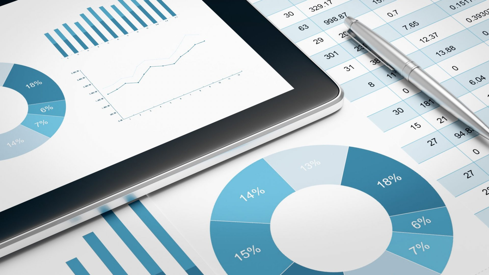
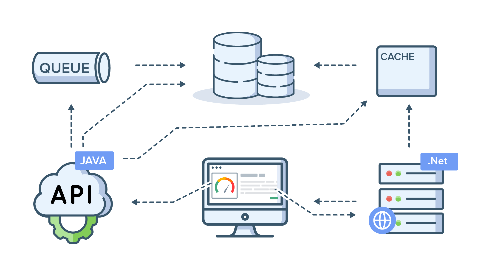
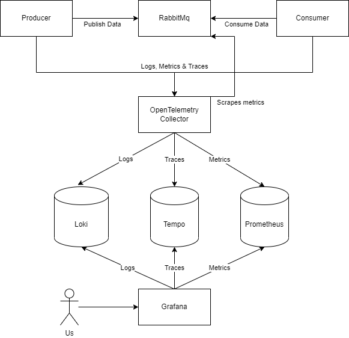
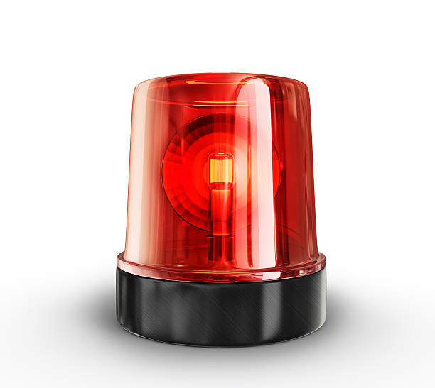

    
# Observability Quickstart

- Metrics
- Tracing
- Logging

---
# Metrics

- What is it?
  - Quantitative indicators of how your system is doing
- Why do i need it?
  - To monitor performance
  - To get notified when your system is misbehaving
  - To help you analyze complex issues

---
# Tracing

- What is it?
  - Detailed insights into how some initial action (user request, data ingress, etc.) travels through your system
- Why do i need it?
  - To pinpoint performance issues
  - It's likely the best tool for root-cause analysis in complex systems
  
---
# (Structured) Logging

- What is it?
  - Detailed insights into what, when, how, who and where things are happening.
- Why do i need it?
  - To assist in troubleshooting your system
  - For auditing purposes

---
# OpenTelemetry Collector
- What is the OpenTelemetry Initiative?
- What problem does the OpenTelemetry Collector solve?
- When should you use it?

---
# Demo time!

## First
- Producer -> Consumer
## Then
- Producer -> (Forwarder -> ) x 10 -> Consumer
---
# Alerting

- One of the end goals of observability
- Usually backed by metrics
- Makes looking at metrics obsolete

---

# Here be dragons
- Metrics
  - Can be imprecise
  - Faulty dashboards and missing data can cause false negatives/positives
  - High cardinality can make costs explode
- Traces
  - Often incurs higher data throughput than all business logic
- Logs
  - Only really useful for debugging when lower log-levels are enabled
    - Consider runtime-switchable log-levels
- Generally
  - Observability is expensive up-front, but improves troubleshooting efficiency, reduces downtime and boosts confidence in your system.
---
# Questions?
